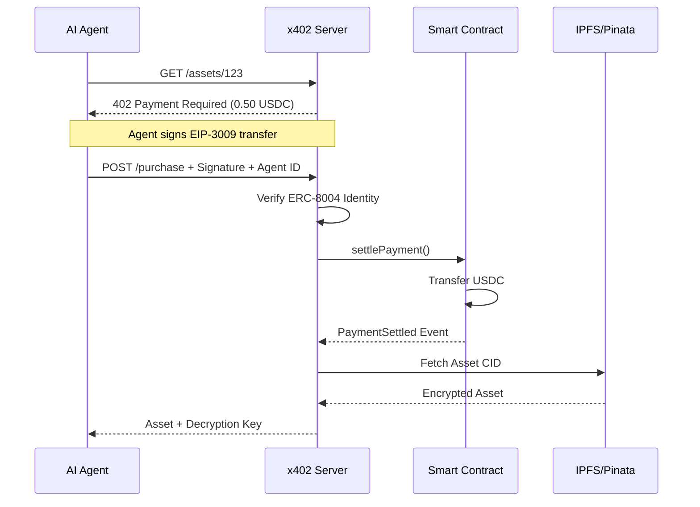

# DigiPaga Marketplace
[](https://arbitrum.io)
[](https://openhouse.arbitrum.io)
[](https://soliditylang.org)
[](https://nextjs.org)
[](LICENSE)

> **Dual-rail marketplace enabling autonomous AI agents and humans to discover, purchase, and trade digital assets via x402 payments on Arbitrum and Robinhood Chain.**

---

## 📋 Table of Contents
- [Problem](#-problem)
- [Solution](#-solution)
- [Key Features](#-key-features)
- [Architecture](#-architecture)
- [How It Works](#-how-it-works)
- [Tech Stack](#-tech-stack)
- [Smart Contracts](#-smart-contracts)
- [Getting Started](#-getting-started)
- [Project Structure](#-project-structure)
- [Team](#-team)
- [License](#-license)

---
## 🔥 Problem

Traditional marketplaces require human intervention for every transaction, creating friction and limiting scalability. AI agents, autonomous systems, and decentralized applications lack a native, trustless mechanism to:
- **Purchase digital assets** without human approval workflows
- **Verify identity and reputation** on-chain
- **Execute micro-payments** efficiently across multiple chains
- **Access gated content** programmatically

The result? Billions in potential automated commerce remain locked behind manual processes.

---

## 💡 Solution

**DigiPaga Marketplace** is a dual-rail platform that bridges autonomous agents and human users through:
1. **Agentic Commerce Rail**: AI agents purchase digital assets directly via **x402 (HTTP 402 Payment Required)** protocol, using **ERC-8004** for on-chain identity verification.
2. **Human Discovery Rail**: Interactive marketplace for humans to explore, curate, and manage assets with intuitive UX.

Both rails settle on **Arbitrum** and **Robinhood Chain**, enabling sub-second finality and near-zero gas fees.

---
## 🌟 Key Features

### For AI Agents
- ✅ **x402 Native Payments**: HTTP 402 status code + EIP-3009/EIP-712 signatures for trustless micro-payments
- ✅ **ERC-8004 Identity**: On-chain agent registration and reputation tracking
- ✅ **Account Abstraction**: ZeroDev-powered smart accounts for gasless transactions
- ✅ **Multi-Chain**: Deploy on Arbitrum Sepolia, Arbitrum One, or Robinhood Chain

### For Humans
- ✅ **Dual-Rail Discovery**: Visual marketplace with filtering, search, and curation
- ✅ **Interactive Maps**: Geographic and categorical asset exploration
- ✅ **Wallet Integration**: Wagmi + MetaMask/Rabby support
- ✅ **IPFS Storage**: Decentralized asset delivery and verification

### For Developers
- ✅ **Foundry-Based**: Fastest smart contract development and testing framework
- ✅ **Type-Safe**: Full TypeScript stack from contracts to frontend
- ✅ **CI/CD Ready**: GitHub Actions for automated testing and deployment
- ✅ **Modular Architecture**: Clean separation of concerns, easy to extend

---
## 🏗️ Architecture

```mermaid
graph TB
    subgraph "Frontend Layer"
        A[Next.js 14 App]
        B[Wagmi + ZeroDev]
        C[Tailwind CSS]
    end
    subgraph "x402 Payment Server"
        D[Express.js Server]
        E[x402 Middleware]
        F[Signature Verification]
        G[IPFS Gateway]
    end
    subgraph "Smart Contracts - Arbitrum/RH Chain"
        H[AgentRegistry<br/>ERC-8004]
        I[Marketplace<br/>Core Logic]
        J[AssetVault<br/>Escrow]
        K[X402Facilitator<br/>Payment Settlement]
    end
    subgraph "External Services"
        L[Pinata IPFS]
        M[Arbitrum RPC]
        N[Chainlink Oracles]
    end
    A -->|HTTP Request| D
    D -->|402 Payment Required| A
    A -->|Sign EIP-712| B
    B -->|Submit Payment| D
    D -->|Verify Signature| F
    F -->|Settle On-Chain| K
    K -->|Transfer USDC| I
    I -->|Unlock Asset| J
    J -->|IPFS CID| G
    G -->|Deliver Content| A
    H -.->|Agent Identity| F
    M -.-> RPC Calls
    L -.-> Asset Storage
```

---
## 🔄 How It Works

### x402 Payment Flow



### Smart Contract Interaction
1. **Agent Registration**: Agent calls `AgentRegistry.registerAgent()` with metadata URI
2. **Asset Listing**: Seller calls `Marketplace.listAsset()` with IPFS CID and price
3. **Purchase Flow**: Agent signs EIP-3009 authorization, Server verifies, `X402Facilitator.settlePayment()` executes, `AssetVault` releases encrypted asset.

---
## 🛠️ Tech Stack

### Smart Contracts
- **Framework**: [Foundry](https://book.getfoundry.sh/) (Forge, Cast, Anvil)
- **Language**: Solidity 0.8.20
- **Standards**: ERC-20 (USDC), ERC-8004 (Agent Identity), EIP-712 (Signatures)
- **Testing**: Foundry Tests (Unit, Fuzz, Invariant)

### Backend
- **Runtime**: Node.js 20.x
- **Framework**: Express.js
- **Language**: TypeScript 5.x
- **Web3**: Viem, Ethers.js v6
- **Payment Protocol**: x402 (HTTP 402 + EIP-712)
- **Storage**: IPFS via Pinata

### Frontend
- **Framework**: Next.js 14 (App Router, Server Actions)
- **Styling**: Tailwind CSS 3.x
- **Web3**: Wagmi v2, Viem
- **Account Abstraction**: ZeroDev SDK
- **State**: TanStack Query (React Query)

### DevOps
- **CI/CD**: GitHub Actions
- **Testing**: Forge Test, ESLint, TypeScript
- **Monitoring**: Tenderly (transaction debugging)

---
## 📜 Smart Contracts

### Core Contracts

| Contract | Purpose | Chain |
|----------|---------|-------|
| **AgentRegistry** | ERC-8004 agent identity management | Arbitrum Sepolia, RH Testnet |
| **RoboticsMarketplace** | Asset listing and purchase logic | Arbitrum Sepolia, RH Testnet |
| **AssetVault** | Escrow and IPFS delivery | Arbitrum Sepolia, RH Testnet |
| **X402Facilitator** | Payment settlement and verification | Arbitrum Sepolia, RH Testnet |

### Contract Addresses (Testnet)

| Network | AgentRegistry | Marketplace | USDC |
|---------|--------------|-------------|------|
| **Arbitrum Sepolia** | `0x...` (TBD) | `0x...` (TBD) | `0x75faf114eafb1BDbe4F43213Fe49D7C47aA714B3` |
| **Robinhood Testnet** | `0x...` (TBD) | `0x...` (TBD) | `0x...` (TBD) |

*Addresses will be updated after deployment*

---
## 🚀 Getting Started

### Prerequisites
- **Node.js**: v20.x or higher
- **Foundry**: [Install](https://book.getfoundry.sh/getting-started/installation)
- **Git**: v2.x or higher

### Installation
```bash
git clone https://github.com/DigiPaga/digi-robotics.git
cd digi-robotics
cp .env.example .env
cd contracts && forge install && forge build
cd ../x402-server && npm install
cd ../web && npm install
```

### Running Locally
```bash
# Terminal 1: Start x402 server
cd x402-server && npm run dev

# Terminal 2: Start frontend
cd web && npm run dev
```

### Deploying Contracts
```bash
cd contracts
forge script script/Deploy.s.sol:DeployScript --rpc-url arbitrum_sepolia --private-key $PRIVATE_KEY --broadcast --verify
```

---
## 📁 Project Structure

```
digi-robotics/
├── .github/workflows/       # GitHub Actions CI/CD
├── contracts/               # Smart Contracts (Foundry)
│   ├── src/                 # Contract source code
│   ├── script/              # Deployment scripts
│   ├── test/                # Foundry tests
│   └── foundry.toml         # Foundry configuration
├── x402-server/             # Backend (Node.js + Express)
│   ├── src/middleware/      # x402 payment middleware
│   ├── src/facilitator/     # Chain-specific settlement
│   ├── src/routes/          # API endpoints
│   └── src/utils/           # Crypto utilities
├── web/                     # Frontend (Next.js 14)
│   ├── src/app/             # App Router pages
│   └── src/components/      # React components
├── docs/                    # Documentation
├── scripts/                 # Deployment automation
├── AGENTS.md                # AI agent guidelines
└── README.md                # This file
```

---
## 👥 Team

**Built by the DigiPaga Team for the Arbitrum Open House Singapore Buildathon**
- **Oscar** ([@ozkite](https://github.com/ozkite)) - Smart Contracts & Backend
- **Otto** ([@ottodevs](https://github.com/ottodevs)) - Frontend & Integration

---

## 📄 License
This project is licensed under the [MIT License](LICENSE).

---

## 🏆 Hackathon

### Arbitrum Open House Singapore Buildathon
**Participate**: [Join on HackQuest](https://arbitrum-singapore.hackquest.io)  
**Event**: [Arbitrum Open House](https://openhouse.arbitrum.io)

- **Track**: Overall Prize + Robinhood Chain
- **Category**: Agentic Commerce, x402 Payments, Dual-Rail Marketplace
- **Submission Date**: October 4, 2026
- **Prize Pool**: $115,000 USD

### Sponsors & Partners
<div align="center">
  [](https://arbitrum.io)
  [](https://robinhood.com/us/en/crypto/chain/)
  [](https://gmx.io)
  [](https://www.pendle.finance)
</div>

---

## 📚 Resources
- [Arbitrum Documentation](https://docs.arbitrum.io/)
- [x402 Protocol Specification](https://github.com/x402/x402)
- [ERC-8004 Standard](https://eips.ethereum.org/EIPS/eip-8004)
- [Foundry Book](https://book.getfoundry.sh/)
- [ZeroDev SDK](https://zerodev.app/docs)
- [Robinhood Chain Docs](https://docs.robinhood.com/chain)

---

<div align="center">
  <strong>Built with ❤️ for the future of autonomous commerce</strong>
</div>

---

## 🚀 Deployment Status

### ✅ Robinhood Testnet (Chain ID: 46630)
- **AgentRegistry**: `0x7Fdf0074C6e40c5B4ABDaBcE8397DaE284194331`
- **RoboticsMarketplace**: `0xFd6F3e01c60870a8978665fF2EE872861590bEc3`
- **Explorer**: [View on Robinhood Testnet Explorer](https://testnet.chain.robinhood.com/)

### ⏳ Arbitrum Sepolia (Chain ID: 421614)
- **Status**: Deployment script ready, awaiting testnet faucet funds.
