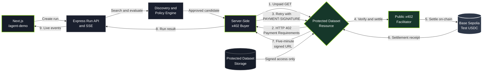

# DigiRobotics: Agentic Commerce for Physical AI


> **An AI-native egocentric capture marketplace powered by stablecoins and the x402 protocol.**  
> Built for the **Arbitrum Open House Singapore Buildathon**.

[](https://arbitrum.io)
[](https://robinhood.com/us/en/crypto/chain/)
[](https://paxos.com)
[](https://zerodev.app)
[](https://nextjs.org)
[](LICENSE)

---

## 🚀 Real x402 Agent Demo

The `/agent-demo` route demonstrates a complete **x402 v2 payment cycle** on Base Sepolia:

1. An unpaid resource request receives a machine-readable **HTTP 402 Payment Required** response.
2. A deterministic server-side agent validates the payment against strict spending policies.
3. The agent signs an **EIP-3009 `transferWithAuthorization`** authorization using **EIP-712** typed data for `0.05` test USDC.
4. The agent retries the protected resource with the x402 payment signature.
5. The public x402 facilitator verifies and settles the payment on-chain.
6. Only after confirmed settlement does the server issue a short-lived signed URL for the protected robotics dataset.

> **Dual-rail architecture:** The autonomous-agent demo uses x402 with test USDC on Base Sepolia. The human checkout flow uses direct ERC-20 mUSDG transfers on Arbitrum Sepolia.

📖 **Full runbook:** [`x402-server/docs/AGENT_DEMO_RUNBOOK.md`](x402-server/docs/AGENT_DEMO_RUNBOOK.md)

---

## 📋 Table of Contents

- [Problem](#-problem)
- [Solution](#-solution)
- [Key Features](#-key-features)
- [Architecture](#️-architecture)
- [How It Works: The x402 Flow](#-how-it-works-the-x402-flow)
- [Tech Stack](#️-tech-stack)
- [Smart Contracts](#-smart-contracts)
- [Getting Started](#-getting-started)
- [Project Structure](#-project-structure)
- [Sponsors and Integrations](#-sponsors-and-integrations)
- [Team](#-team)
- [ETHSKILLS Integration](#-ethskills-integration)
- [License](#-license)

---

## 🔥 Problem

Traditional data marketplaces require human intervention for discovery, purchasing, verification, and delivery. This creates friction and prevents autonomous systems from operating at machine speed.

AI agents, robotics teams, and decentralized applications lack a unified mechanism to:

- **Discover robotics training data** programmatically.
- **Purchase digital resources** without manual approval workflows.
- **Execute micropayments** using machine-readable payment requirements.
- **Verify settlement** before accessing protected content.
- **Reward human contributors** for capturing valuable real-world actions.

As a result, valuable human dexterity data remains difficult to source while billions of smartphones remain underutilized as capture devices.

---

## 💡 Solution

**DigiRobotics** connects human contributors, robotics teams, datasets, and autonomous agents through two purpose-built payment rails:

1. **Agentic Commerce**  
   A real x402 v2 `exact` payment flow using test USDC on Base Sepolia. A server-side agent discovers a dataset, validates its payment requirements, signs an EIP-3009 authorization, and unlocks the resource after confirmed settlement.

2. **Human Checkout**  
   A Thirdweb and ZeroDev embedded-wallet experience using direct mUSDG transfers on Arbitrum Sepolia, with no seed phrases required.

Together, these rails create a marketplace where humans can capture and monetize robotics training data while autonomous agents discover, verify, purchase, and consume it.

---

## 🌟 Key Features

### For AI Agents

- ✅ **Native x402 payments:** HTTP 402 responses with EIP-3009 and EIP-712 payment authorizations.
- ✅ **Deterministic discovery:** Programmatic dataset discovery and selection without requiring an LLM.
- ✅ **Strict spending policy:** Validation of network, token, host, recipient, amount, timeout, and one-payment-per-run limits.
- ✅ **Settlement evidence:** Facilitator response, on-chain transaction receipt, and seller balance-delta verification.
- ✅ **Protected delivery:** Dataset access is never issued before successful settlement.
- ✅ **Idempotent execution:** Reconnecting or refreshing cannot trigger duplicate payments.

### For Human Contributors

- ✅ **Zero-friction onboarding:** Embedded wallets without seed phrases.
- ✅ **Egocentric capture:** Contributors can upload first-person robotics training videos.
- ✅ **Stablecoin rewards:** Contributors can receive USDG or PYUSD after validation.
- ✅ **Telegram ingestion:** Video submissions can be captured through the DigiRobotics Telegram bot.
- ✅ **Campaign discovery:** Contributors can find tasks requested by robotics teams.

### For Robotics Teams

- ✅ **Curated training data:** Discover video datasets organized by task, environment, and quality.
- ✅ **Custom data requests:** Request audiovisual, software, hardware, or specialized capture campaigns.
- ✅ **Agent-ready resources:** Allow autonomous buyers to discover and purchase protected datasets.
- ✅ **Programmatic delivery:** Retrieve purchased resources through protected API endpoints.

### For Developers

- ✅ **Full TypeScript stack:** Shared types across the frontend and backend.
- ✅ **Foundry-based contracts:** Fast Solidity testing, deployment, fuzzing, and invariant testing.
- ✅ **Modular architecture:** Clear separation between the frontend, agent runtime, payment policy, protected resources, contracts, and storage.
- ✅ **Fail-closed configuration:** Missing payment or wallet configuration does not expose protected content.

---

## 🏗️ Architecture


```mermaid
flowchart LR
    A["Next.js<br/>/agent-demo"] -->|"Create run"| B["Express Run API<br/>and SSE"]
    B -->|"Search and evaluate"| C["Discovery and<br/>Policy Engine"]
    C -->|"Approved candidate"| D["Server-Side<br/>x402 Buyer"]

    D -->|"1. Unpaid GET"| E{"Protected Dataset<br/>Resource"}
    E -->|"2. HTTP 402<br/>Payment Requirements"| D
    D -->|"3. Retry with<br/>PAYMENT-SIGNATURE"| E

    E -->|"4. Verify and settle"| F["Public x402<br/>Facilitator"]
    F -->|"5. Settle on-chain"| G[("Base Sepolia<br/>Test USDC")]
    G -->|"6. Settlement receipt"| E

    E -->|"7. Five-minute<br/>signed URL"| D
    D -->|"8. Run result"| B
    B -->|"9. Live events"| A

    H[("Protected Dataset<br/>Storage")] -->|"Signed access only"| E

    classDef frontend fill:#161c29,stroke:#84cc16,stroke-width:2px,color:#ffffff
    classDef backend fill:#1a1f2e,stroke:#a0a0a0,stroke-width:1px,color:#ffffff
    classDef agent fill:#1a1f2e,stroke:#84cc16,stroke-width:2px,color:#ffffff
    classDef facilitator fill:#16372a,stroke:#84cc16,stroke-width:2px,color:#ffffff
    classDef chain fill:#2d3748,stroke:#ffffff,stroke-width:2px,color:#ffffff
    classDef storage fill:#161c29,stroke:#a0a0a0,stroke-width:1px,color:#ffffff

    class A frontend
    class B,C backend
    class D agent
    class E,F facilitator
    class G chain
    class H storage
```

### Human Checkout Rail


```mermaid
flowchart LR
    A["Next.js Marketplace"] --> B["Thirdweb Authentication"]
    B --> C["ZeroDev Embedded Wallet"]
    C --> D["Direct mUSDG Transfer"]
    D --> E[("Arbitrum Sepolia")]
    E --> F["Human Checkout Confirmation"]

    classDef frontend fill:#161c29,stroke:#84cc16,stroke-width:2px,color:#ffffff
    classDef wallet fill:#1a1f2e,stroke:#84cc16,stroke-width:2px,color:#ffffff
    classDef chain fill:#2d3748,stroke:#ffffff,stroke-width:2px,color:#ffffff

    class A frontend
    class B,C,D wallet
    class E,F chain
```

---

## 🔄 How It Works: The x402 Flow

### 1. Preflight

The run API validates:

- Agent wallet balance.
- Supported network and token.
- Allowed resource host.
- Allowed payment recipient.
- Maximum payment amount.
- Facilitator availability.
- Dataset configuration.

### 2. Discovery

The agent searches the configured dataset registry and evaluates compatible resources using deterministic selection logic.

### 3. Challenge

The agent requests:

```http
GET /x402/datasets/:id/content
```

Because no payment signature is attached, the server responds with:

```http
HTTP/1.1 402 Payment Required
```

The response includes machine-readable x402 payment requirements.

### 4. Policy Validation

Before signing, the agent validates:

- Network.
- Asset address.
- Payment scheme.
- Atomic amount.
- Recipient.
- Resource URL.
- Host allowlist.
- Spending limit.
- Request timeout.
- Run idempotency.

### 5. Authorization

The server-side EOA signs an EIP-3009 authorization using EIP-712 typed data.

No agent private key is exposed to the browser.

### 6. Settlement

The agent retries the protected resource with the x402 payment signature.

The facilitator verifies the authorization and settles the payment on Base Sepolia.

### 7. Fulfillment

After settlement, the backend verifies:

- Facilitator success response.
- On-chain transaction receipt.
- Successful receipt status.
- Expected seller balance delta.
- Correct asset and amount.

The backend then issues a short-lived signed dataset URL.

### 8. Delivery

The frontend receives genuine backend events through Server-Sent Events and displays:

- Selected dataset.
- Network and asset.
- Payment amount.
- Transaction hash.
- Explorer link.
- Settlement result.
- Dataset unlock status.

---

## 🛠️ Tech Stack

| Layer | Technologies |
|---|---|
| Smart contracts | Foundry, Solidity 0.8.20, EIP-712, EIP-3009, ERC-8004 |
| Backend | Node.js, Express.js, TypeScript, x402 v2 |
| Frontend | Next.js 16, React 19, Tailwind CSS 4 |
| Web3 | Viem, Wagmi v2 |
| Account abstraction | ZeroDev SDK, ERC-4337 session keys |
| Authentication | Thirdweb |
| Storage | Pinata and IPFS |
| RPC infrastructure | QuickNode |
| Analytics | Dune Analytics |
| CI/CD | GitHub Actions |

---

## 📜 Smart Contracts

### Active Agent Demo Infrastructure

| Network | Component | Purpose |
|---|---|---|
| Base Sepolia | Public x402 facilitator | Payment verification and settlement |
| Base Sepolia | Test USDC | EIP-3009 `transferWithAuthorization` payment asset |
| Base Sepolia | Server-side agent wallet | Signs bounded x402 payment authorizations |
| Base Sepolia | Seller wallet | Receives dataset micropayments |

### Human Checkout Infrastructure

| Network | Component | Purpose |
|---|---|---|
| Arbitrum Sepolia | MockUSDG | Human marketplace checkout asset |
| Arbitrum Sepolia | ZeroDev account | Embedded smart-account experience |
| Arbitrum Sepolia | Thirdweb authentication | User authentication and onboarding |

### Legacy and Prototype Contracts

| Contract | Purpose | Networks |
|---|---|---|
| `AgentRegistry` | ERC-8004 agent identity management | Arbitrum Sepolia, Robinhood Chain testnet |
| `RoboticsMarketplace` | Dataset listing and purchase logic | Arbitrum Sepolia, Robinhood Chain testnet |
| `AssetVault` | Escrow and IPFS delivery | Arbitrum Sepolia, Robinhood Chain testnet |

---

## 🚀 Getting Started

### Prerequisites

- **Node.js:** 20.9 or later
- **npm:** Compatible with the installed Node.js version
- **Foundry:** [Installation guide](https://book.getfoundry.sh/getting-started/installation)
- **Git:** 2.x or later

### 1. Clone the Repository

```bash
git clone https://github.com/DigiPaga/digi-robotics.git
cd digi-robotics
```

### 2. Install Backend Dependencies

```bash
cd x402-server
npm install
cp .env.example .env
```

Configure the required backend environment variables in `x402-server/.env`.

Do not commit real wallet keys or API credentials.

### 3. Install Frontend Dependencies

```bash
cd ../web
npm install
cp .env.example .env.local
```

Configure the frontend API URL and other public environment variables in `web/.env.local`.

Never expose agent private keys through `NEXT_PUBLIC_*` variables.

### 4. Install and Build the Contracts

```bash
cd ../contracts
forge install
forge build
forge test
```

### 5. Run the Backend

Open a terminal:

```bash
cd x402-server
npm run dev
```

The backend runs at:

```text
http://localhost:3001
```

### 6. Run the Frontend

Open a second terminal:

```bash
cd web
npm run dev
```

The frontend runs at:

```text
http://localhost:3000
```

### 7. Open the Agent Demo

```text
http://localhost:3000/agent-demo
```

### Verify the Protected Resource

An unpaid request should return HTTP 402:

```bash
curl -i http://localhost:3001/x402/datasets/engine-assembly-pov/content
```

Expected status:

```http
HTTP/1.1 402 Payment Required
```

For the complete funding, configuration, and verification procedure, see:

[`x402-server/docs/AGENT_DEMO_RUNBOOK.md`](x402-server/docs/AGENT_DEMO_RUNBOOK.md)

---

## 📁 Project Structure

```text
digi-robotics/
├── contracts/                       # Solidity contracts and Foundry tests
│   ├── src/
│   ├── script/
│   └── test/
├── docs/                            # Project documentation
├── web/                             # Next.js frontend
│   ├── public/
│   │   └── pitch-deck/
│   └── src/
│       ├── app/
│       │   └── agent-demo/
│       ├── components/
│       └── lib/
├── x402-server/                     # Express backend and agent runtime
│   ├── docs/
│   │   └── AGENT_DEMO_RUNBOOK.md
│   ├── src/
│   │   ├── agent/
│   │   ├── config/
│   │   ├── data/
│   │   ├── routes/
│   │   ├── telegramBot.ts
│   │   └── server.ts
│   └── uploads/
├── LICENSE
└── README.md
```

---

## 🏆 Sponsors and Integrations

DigiRobotics uses infrastructure and tooling from the following ecosystem partners:

| Sponsor or Integration | Contribution |
|---|---|
| Arbitrum | L2 infrastructure and Buildathon host |
| Robinhood Chain | Testnet experimentation |
| Paxos | USDG and PYUSD stablecoin ecosystem |
| ZeroDev | ERC-4337 account abstraction |
| Thirdweb | Authentication and wallet onboarding |
| QuickNode | RPC infrastructure |
| Pinata | IPFS storage and content delivery |
| Dune Analytics | On-chain marketplace analytics |

---

## 👥 Team

Built by the DigiPaga team for the Arbitrum Open House Singapore Buildathon.

- **Oscar Andrade ([@ozkite](https://github.com/ozkite))** — Smart contracts and backend
- **Otto ([@ottodevs](https://github.com/ottodevs))** — Frontend and integration

---

## 🎓 ETHSKILLS Integration

This project follows ETHSKILLS guidance for production-oriented Ethereum development, with additional consideration for L2 execution and sequencer behavior.

### Principles Applied

- ✅ **Security-first development:** Contracts and backend flows are reviewed and tested against common vulnerabilities, including reentrancy and access-control failures.
- ✅ **Spending constraints:** Autonomous payments are restricted by explicit asset, network, recipient, host, amount, and timeout policies.
- ✅ **Gas awareness:** Storage and computation patterns are designed with L2 execution in mind.
- ✅ **Testing:** Foundry unit, fuzz, and invariant tests are used where applicable.
- ✅ **Typed transactions:** EIP-712 typed data is used for payment authorization.
- ✅ **Secret isolation:** Agent signing credentials remain on the backend.
- ✅ **Documentation:** Contracts and critical flows include NatSpec and implementation documentation.

### Tools Used

- **Foundry:** Contract compilation, testing, fuzzing, and deployment.
- **OpenZeppelin:** Standard contract implementations and security primitives.
- **ZeroDev:** ERC-4337 smart accounts and session-key infrastructure.
- **Viem:** Typed EVM reads, writes, and receipt verification.
- **x402:** Machine-readable HTTP payment requirements and settlement.
- **Pinata:** IPFS storage and controlled dataset delivery.

---

## 🔐 Security Notes

- Never commit `.env` or `.env.local` files.
- Never expose agent wallet keys to the frontend.
- Never unlock protected content after transaction submission alone.
- Always verify settlement and receipt status before fulfillment.
- Restrict autonomous spending through explicit allowlists and maximum amounts.
- Rotate any credentials that have been exposed during development.
- Use testnet assets only for the public demonstration.

---

## 🗺️ Current Demo Status

| Capability | Status |
|---|---|
| Marketplace interface | ✅ Available |
| Human mUSDG checkout | ✅ Testnet demo |
| x402 protected resource | ✅ Available |
| Deterministic agent buyer | ✅ Available |
| HTTP 402 challenge | ✅ Available |
| EIP-3009 authorization | ✅ Available |
| Facilitator settlement | ✅ Available |
| Signed dataset delivery | ✅ Available |
| Telegram capture ingestion | 🧪 Prototype |
| Production stablecoin settlement | 🚧 Planned |
| Mainnet deployment | 🚧 Planned |

---

## 📄 License

This project is released under the [MIT License](LICENSE).

---

<div align="center">

**Built with ❤️ for the future of autonomous commerce.**

*Arbitrum Open House Singapore Buildathon*  
*Submission date: October 4, 2026 · Prize pool: $115,000 USD*

</div>
